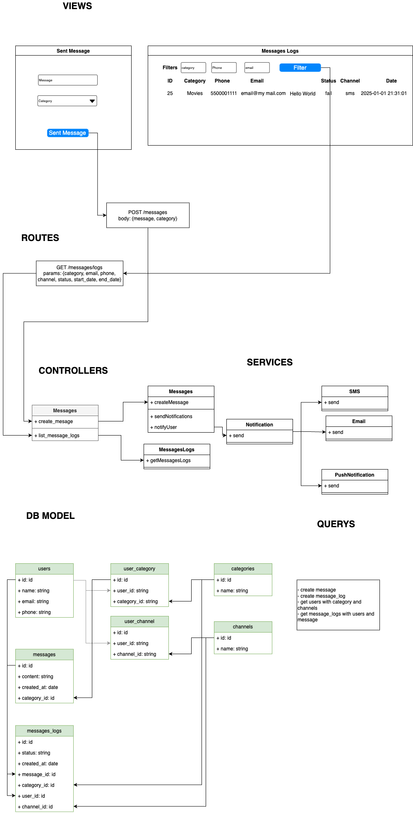

# Notification System Project

This project is a notification system built with Laravel and Laravel Sail, allowing users to receive messages based on their subscriptions to different categories through various channels (SMS, Email, Push Notification).



## Features

-   **Send Notifications**: Users can receive notifications based on their category subscriptions through SMS, Email, or Push Notification.
-   **View Logs**: A comprehensive log of all messages sent to users is available, filterable by category, email, phone, status, and channel.

## Requirements

-   Docker
-   Docker Compose

## Setup Instructions

1. **Clone the Repository**

    ```bash
    git clone https://github.com/miguel719/notification_app
    cd notification_app
    ```

2. Run the Setup Script

This script will install all dependencies, run migrations, seed the database, and build front-end assets:

```bash
./setup.sh
```

After the setup is complete you can navigate to http://localhost

3. Running Tests

This script will install all dependencies, run migrations, seed the database, and build front-end assets:

```bash
./test.sh
```
